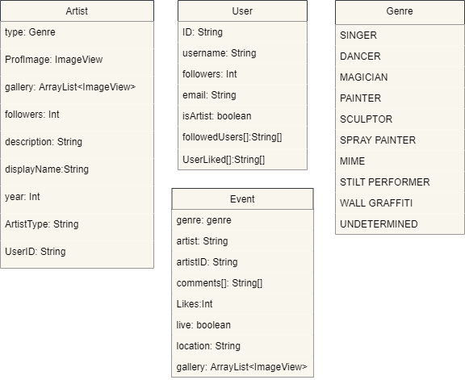

# Urban Arts

### This is a project that was designed by 3 students of Athens University of Economics and Business. 
## Main Idea
The main idea behind the project is to create an android application (media type) that actually helps artists become known to more people, while also gives users the option to find any kind of art around them. (For example Graffities or some live events such as music performances.) Artists have profiles that users can follow to get information about the artists and users themselves can create posts either for live events that they came across happening or for pieces of art around the city that people may be intrested to find.
##### [Here](http://github.com) is a guide of the main usage of our application in Greek
## Contributors and Tools
### Participants:

* Giorgos Fotopoulos 
* Panagiotis Ntymenos
* Giorgos Patrikis

For the completion of the project we used Android Studio and the database we are using is a firebase db. A noSql database that allows you to send requests for database data directly from the code.

## DB Structure 
keep in mind that firebase is a noSQL database so maybe some fields may differ between simillar collections

## Future work
* We have been using the free version of firebase at the time of the publicity of our project. This means that we cannot use the firebase periodical funtions. This is one of the main changes that we would like to adjust. Some of the main function to preserve the database in a good state that are implemented are client based. We understand that this should not be hapening.

* We implemented this project during an academic semester and the practical part of it took us almost 1 month, in which we were working full time (days and nights). If we had more time we would definitely make an MVC approach to make our code easier to understand and to preserve.

* We could be using sorting depending on the likes of the post and the amount of people that follows a certain artist. This only makes sence when a certain ammount of people are using the database.

* Posts should also have a title. In most cases it is not needed but in others seems important.

* A share button at posts and artist profiles to send urls to other media to open the application in the exact page.
